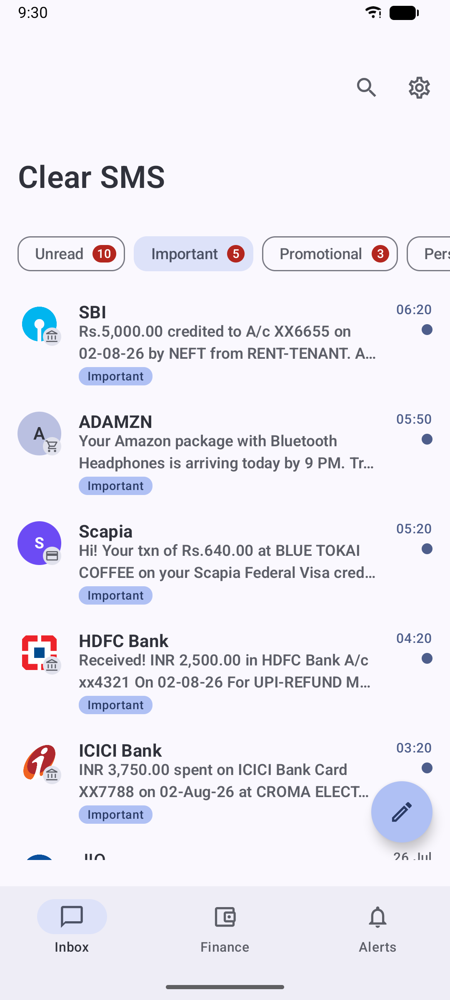
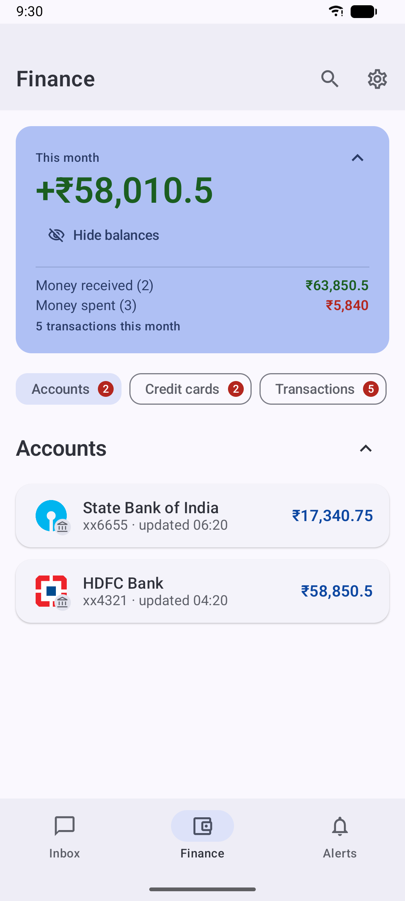
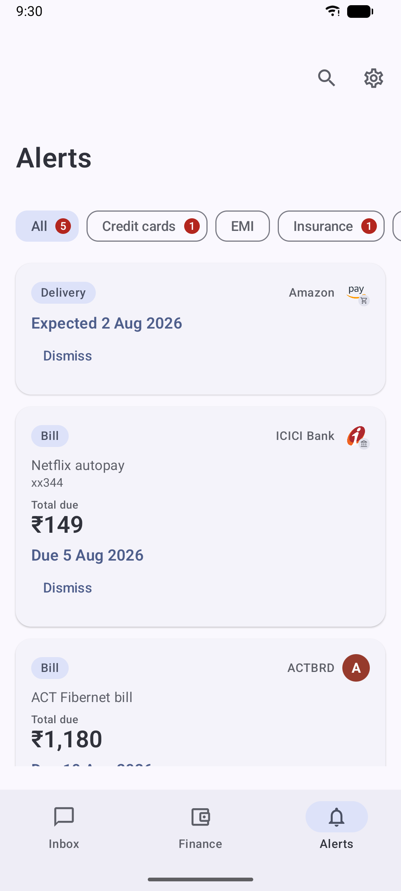
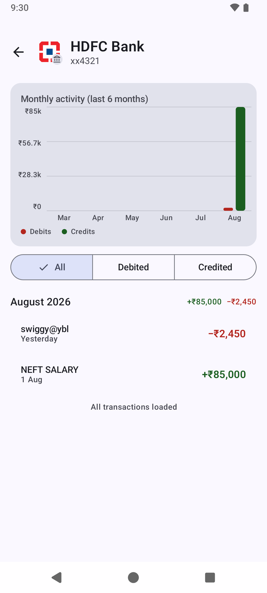
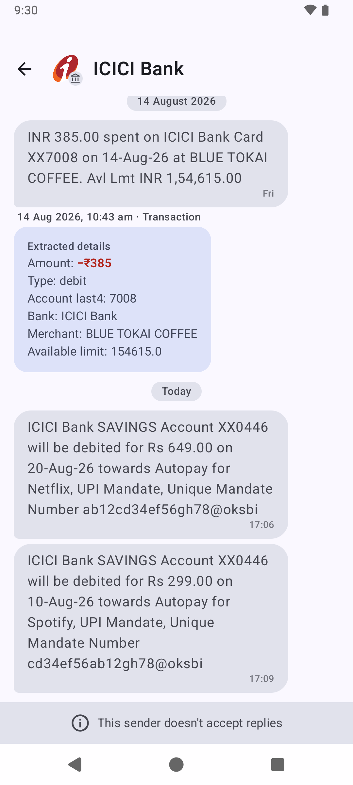
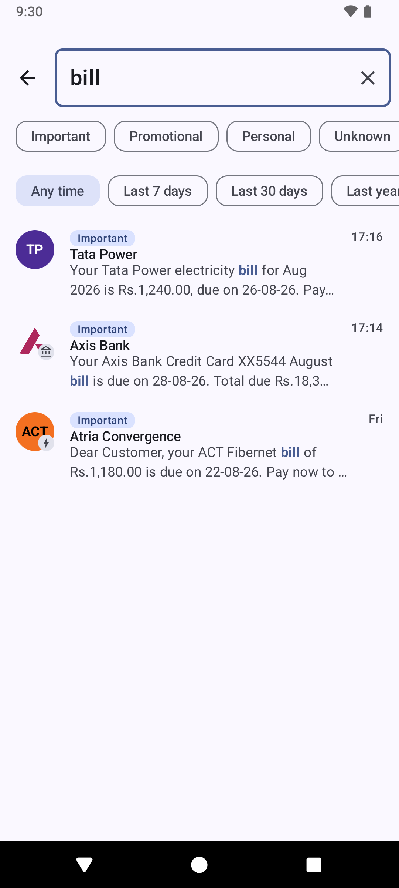
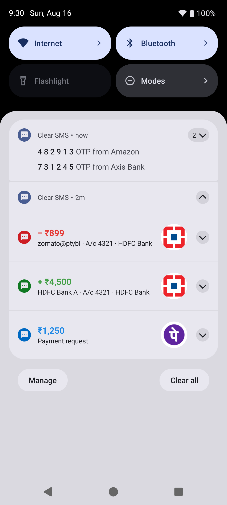
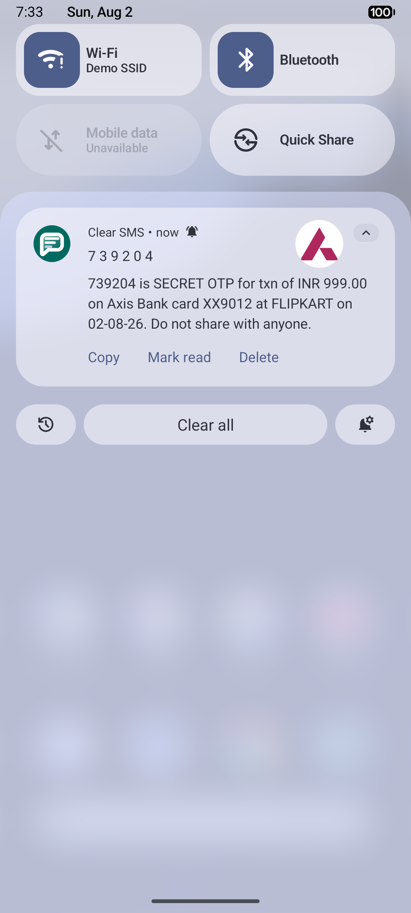
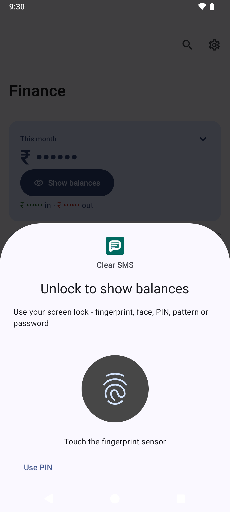
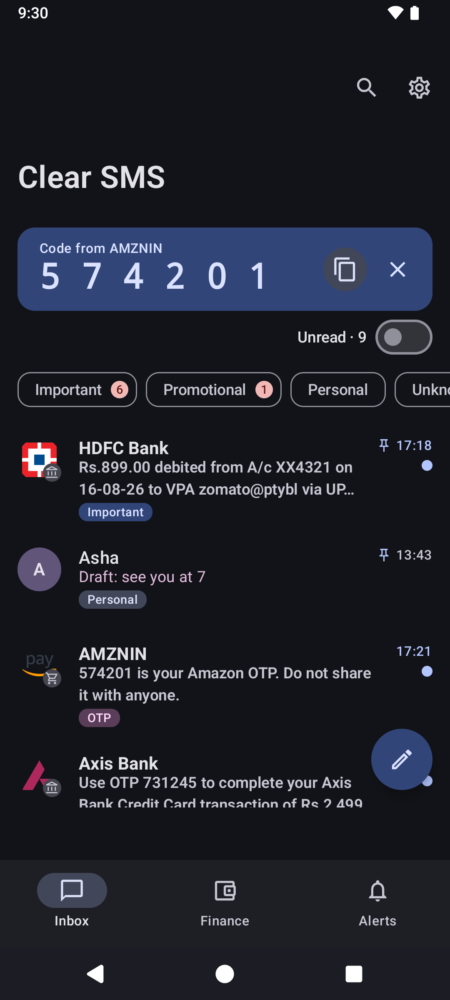

# Clear SMS

[](https://github.com/itsluminous/ClearSMS/actions/workflows/android.yml)
[](https://github.com/itsluminous/ClearSMS/releases/latest)
[](LICENSE)
[](rules/)

**Clear SMS** is an open-source, privacy-first SMS app for Android that automatically
organizes your inbox. It categorizes messages (Important / Promotional / Personal / OTP),
extracts transactions into a personal finance dashboard, surfaces bill reminders, and
handles OTPs intelligently - all completely offline, on your device.

## Features

- **Smart inbox** - messages are automatically sorted into Important, Promotional,
  Personal, Unknown, and OTP using a transparent, regex-based rules engine (no ML black box).
- **MMS receive & send** - picture messages download automatically and can be
  sent from the compose bar (attach from the photo picker, camera, or any
  file; images are compressed to carrier limits on-device). Both directions
  ride the Android system's MMS service, over the carrier network only - see
  Privacy Principles. Image bubbles, a full-screen viewer, and attachment
  files stored app-privately. You can also share an image straight from your
  gallery into a new message. Group MMS is attributed to its sender; a
  dedicated group-conversation UI is not built yet, and MMS delivery reports
  are not supported (sent messages cap at "Sent").
- **Finance dashboard** - debit/credit transactions are extracted from bank SMS into
  accounts, credit cards, and spend summaries with hand-rolled Compose charts.
- **Bills & reminders** - upcoming bills and payment due dates in one Alerts view.
- **OTP handling** - big, copyable OTP notifications, optional auto-copy, and
  configurable auto-delete (24h / 3d / 7d / never).
- **Scam awareness** - heuristic flagging of likely scam/fraud messages.
- **Material You** - dynamic color on Android 12+, with a curated teal/indigo palette
  on older devices. Light, dark, and system themes.
- **Community rules** - categorization rules are plain JSON, bundled with the app and
  maintained by the community in this repository.

## Feature checklist

Everything shipped, and what's on the roadmap:

**Messaging**
- [x] SMS send & receive (default-SMS-app role, catch-up import when the role is regained)
- [x] MMS receive (auto-download, image bubbles, full-screen viewer, retry on failure)
- [x] MMS send (photo picker / camera / any file, on-device compression, SIM-aware)
- [x] Dual-SIM (per-recipient SIM memory, SIM tags on messages)
- [x] Message scheduling (long-press Send; survives reboots)
- [x] Per-thread drafts with inbox preview
- [x] Delivery status: Sending / Sent / Delivered (real reports only) / Not sent + retry
- [x] Share & forward selected messages; share text or images from other apps into a new message
- [x] Undo for delete & archive (Gmail-style snackbar)
- [x] Recycle bin (on by default, 30-day retention, restore & delete-forever)
- [x] Pinned conversations
- [x] Blocked senders & blocked keywords (keyword matches go straight to the bin)
- [ ] Group-MMS conversation UI (group messages currently attribute to their sender)
- [ ] MMS delivery reports
- [ ] Attachments persisted in drafts
- [ ] Scheduling for messages with attachments (currently SMS-only)
- [ ] Blocked keywords applied to MMS bodies

**Smart inbox**
- [x] Automatic categorization: Important / Promotional / Personal / OTP / Unknown (390+ community rules + 715k sender directory)
- [x] Category filter pills (reorderable) with tags hidden under single-category filters
- [x] Full-text search with category & time filters
- [x] Scam-awareness flagging
- [x] Rule manager: search, enable/disable, tap-to-edit your rules, duplicate bundled ones
- [ ] Compose-screen contact suggestions & alphabet fast-scroll

**Finance & alerts**
- [x] Transactions extracted into accounts, cards & wallets with spend charts
- [x] Balance tracking with biometric balance lock
- [x] Bills, autopay, insurance & credit-card due reminders (CRED and undated bills included)
- [x] Train & flight journeys in Alerts
- [x] Deliveries with courier & tracking id
- [x] Time-aware alerts with a complete, restorable "Older" archive
- [x] Cross-bank UPI duplicate collapsing; retirement contributions as credits
- [ ] Conversation details screen (per-sender rename, category & finance view)
- [ ] Per-conversation custom notifications

**Notifications & OTP**
- [x] Parsed transaction notifications with semantic colors and brand logos
- [x] Big copyable OTP notifications, auto-copy, auto-delete policies, one-shot cleanup
- [x] Notifications clear when messages are read in-app (recycle-bin-aware actions)
- [x] Missed-message notifications after signal loss or default-app switches
- [ ] App-wide biometric/PIN lock (today the lock covers Finance balances)

**Data & privacy**
- [x] Fully offline: no INTERNET permission (sole exception: the system's carrier MMS transaction)
- [x] Local backup & restore for messages AND settings (timestamped files, chosen folder, scheduled)
- [x] Settings backup with security-sensitive keys excluded by design
- [ ] Encrypted backups

## Screenshots

| Smart inbox | Finance | Alerts |
| :---: | :---: | :---: |
|  |  |  |

| Account detail | Extracted transaction | Search |
| :---: | :---: | :---: |
|  |  |  |

| Parsed notifications | OTP notification | Balance lock | Dark theme |
| :---: | :---: | :---: | :---: |
|  |  |  |  |

## Privacy Principles

- **Offline by design.** The app requests no INTERNET permission and makes no
  network calls of its own - no servers, no telemetry, no analytics. The one
  exception is inherent to MMS: retrieving a picture message is a transaction
  the *Android system's* MMS service performs with your carrier's MMSC over
  the carrier network. That transaction is how the MMS protocol works, never
  leaves the carrier network, and involves no third party.
- **No proprietary dependencies.** No Firebase, no Play Services - pure AOSP compatible.
- **Your data stays on your device.** Backups are local files you control.
- **Transparent categorization.** Every rule is human-readable JSON you can inspect,
  edit, export, and contribute back.

## Download

Signed APKs are attached to every [GitHub release](https://github.com/itsluminous/ClearSMS/releases/latest).
Pick the build matching your device's CPU, or take the universal APK if unsure:

| APK | Use for |
| --- | --- |
| `ClearSMS-arm64-v8a.apk` | Almost all phones from ~2017 onward (64-bit ARM) |
| `ClearSMS-armeabi-v7a.apk` | Older 32-bit ARM devices |
| `ClearSMS-x86_64.apk` / `ClearSMS-x86.apk` | Emulators and x86 tablets |
| `ClearSMS-universal.apk` | Any device (largest file) |

Check your device's ABI with `adb shell getprop ro.product.cpu.abi`.

## Building

Requirements: JDK 17+ and the Android SDK (compileSdk 35).

```bash
git clone https://github.com/itsluminous/ClearSMS.git
cd ClearSMS
# point to your SDK if ANDROID_HOME is not set:
echo "sdk.dir=$HOME/Library/Android/sdk" > local.properties
./gradlew assembleDebug
```

Run checks the same way CI does:

```bash
./gradlew ktlintCheck lintDebug testDebugUnitTest
```

Release builds are split per ABI: `./gradlew assembleRelease` produces four
per-architecture APKs (`armeabi-v7a`, `arm64-v8a`, `x86`, `x86_64`) plus a
universal APK under `app/build/outputs/apk/release/`. Without signing
environment variables (see below) these are unsigned. Release APKs are
shrunk with R8 and resource shrinking but **not obfuscated**
(`-dontobfuscate` in `app/proguard-rules.pro`), keeping the shipped APK
auditable.

> Follow-up: Gradle dependency verification / lockfiles are not yet
> configured; CI validates the Gradle wrapper checksum but does not yet pin
> dependency hashes.

## Release signing (CI)

CI builds release APKs on every push. If signing secrets are **not** configured
(e.g. on forks), it still succeeds and produces unsigned APKs - signed
publishing activates automatically once the secrets exist.

One-time keystore generation (keep this file and its passwords private; it is
never committed - `*.jks` is gitignored):

```bash
keytool -genkeypair -v -keystore clearsms-release.jks -alias clearsms \
  -keyalg RSA -keysize 4096 -validity 10000
```

Then configure four repository secrets under
*Settings → Secrets and variables → Actions*:

| Secret | Value |
| --- | --- |
| `SIGNING_KEYSTORE_BASE64` | `base64 -i clearsms-release.jks` output |
| `SIGNING_KEYSTORE_PASSWORD` | the keystore password |
| `SIGNING_KEY_ALIAS` | the key alias (e.g. `clearsms`) |
| `SIGNING_KEY_PASSWORD` | the key password |

Or with the GitHub CLI:

```bash
gh secret set SIGNING_KEYSTORE_BASE64 --body "$(base64 -i clearsms-release.jks)"
gh secret set SIGNING_KEYSTORE_PASSWORD
gh secret set SIGNING_KEY_ALIAS --body "clearsms"
gh secret set SIGNING_KEY_PASSWORD
```

Pushing a tag matching `v*` (e.g. `v0.1.0`) creates a GitHub Release with the
per-ABI (`armeabi-v7a`, `arm64-v8a`, `x86`, `x86_64`) and universal APKs
attached, with auto-generated release notes.

## Contributing Rules

Categorization rules live under [`rules/`](rules/) and are bundled into the APK at
build time - every app update ships the latest community rules. See [docs/adding-rules.md](docs/adding-rules.md) for a step-by-step
walkthrough and [CONTRIBUTING.md](CONTRIBUTING.md) for the JSON schema.

Two ways to contribute:

1. **Pull request** - add or edit a JSON file under `rules/<region>/<category>/` and
   open a PR (use the "Rule contribution" issue template if you prefer filing an issue).
2. **Email from the app** - in the app, go to *Settings → Rules → Share rules with
   developer*. This composes an email with your exported rules JSON attached; reviewed
   submissions are incorporated into the next release. There are no runtime rule
   downloads - the app stays fully offline.

### Finding missing rules using your own messages

The most useful contribution is telling us which of *your* messages the app fails
to categorize. `scripts/audit_rule_coverage.py` replays the bundled rules and the
sender-ID directory against a real SMS corpus and reports exactly that. It runs on
your computer, needs no app build, and **masks all digits by default** so the
output is safe to share.

**1. Install the prerequisites**

- Python 3.8 or newer (`python3 --version`)
- `adb`, from the [Android SDK platform-tools](https://developer.android.com/tools/releases/platform-tools)
  (macOS: `brew install android-platform-tools`)
- This repository: `git clone https://github.com/itsluminous/ClearSMS.git && cd ClearSMS`

**2. Enable USB debugging on the phone**

- *Settings → About phone → Software information* and tap **Build number** seven
  times to unlock Developer options
- *Settings → Developer options → USB debugging* → on
- Connect the phone by USB and accept the "Allow USB debugging?" prompt
- Confirm it is visible: `adb devices` should list your device as `device`
  (not `unauthorized`)

**3. Run the check**

```bash
python3 scripts/audit_rule_coverage.py --from-device
```

The script reads your SMS through `adb` into memory only - it writes no copy of
your messages anywhere. Expect it to take a minute or two on a large inbox.

**4. Read the report**

- **Coverage** - the share of messages that got a confident category.
- **Per-rule hit counts** - which rules are doing the work.
- **Unmatched messages** - grouped by sender and body shape, ranked by how often
  they occur. This is the list worth reporting: the senders at the top are the
  biggest gaps.
- **`generic-*` rule breakdown** - messages caught only by the catch-all rules,
  listed per sender. Generic rules are a last-resort safety net, so anything here
  ideally deserves a sender-specific rule.

Useful flags: `--top N` (how many unmatched groups to print), `--generic-top N`
(senders listed per generic rule), `--no-generic-breakdown`, and
`--min-coverage N` (exit non-zero below a threshold, so the audit can gate CI).

**5. Share the findings**

Open an issue using the **Rule contribution** template and paste the *unmatched
groups* and *generic breakdown* sections. Before posting, read what you are about
to share:

- Digits are masked as `X`, but **check the text anyway** - names, email
  addresses, URLs and order references are not masked.
- Never pass `--no-redact` on anything you post publicly.
- Do not attach a full corpus dump, and keep any corpus file outside this
  repository.
- Better still, send a pull request: rules are plain JSON under `rules/`, and the
  schema is documented in [CONTRIBUTING.md](CONTRIBUTING.md).

Rules must contain only generic patterns and public brand/sender names - never
your account numbers, amounts or personal details.

If you would rather not use a computer at all, the app can do a simpler version of
this: *Settings → Rules → Share rules with developer* emails your exported rules
JSON, which tells us what you have had to add by hand.

**Auditing from a file instead of a phone**

If you already have a corpus exported as JSONL (one
`{"sender": ..., "body": ...}` object per line):

```bash
python3 scripts/audit_rule_coverage.py corpus.jsonl --min-coverage 80
```

### Sender ID database

The community-maintained sender ID directory lives at
`rules/sender_ids/india_sender_ids.json.gz`. It is compiled into the SQLite asset the
app ships (`app/src/main/assets/sender_ids.db`) with:

```bash
python3 scripts/build_sender_db.py \
  rules/sender_ids/india_sender_ids.json.gz \
  app/src/main/assets/sender_ids.db
```

After editing the JSON, rebuild the `.db` and include both files in your PR.

For small fixes to wrong upstream entries (e.g. a sender ID mapped to an
unrelated business), you do not need to regenerate the large `.db` asset:
add the corrected entry to
[`rules/sender_ids/corrections.json`](rules/sender_ids/corrections.json)
and copy it to `app/src/main/assets/sender_id_corrections.json` (a unit test
keeps the two identical). Corrections are consulted before the bundled
directory, so they always win for the same normalized sender ID.

### Brand identity table

Sender avatars for well-known brands are drawn from a curated table at
[`rules/brands/brands.json`](rules/brands/brands.json), bundled into the APK as
`app/src/main/assets/brands.json` (a unit test keeps the two copies identical -
edit the `rules/brands/` master and copy it over). For brands without bundled
logo artwork (see below) the app renders an **original** mark from these
facts - a circular tile in the brand's published primary color, a short
monogram, and a category badge - with text color chosen by WCAG luminance so
it stays legible.

Each entry looks like:

```json
{
  "key": "hdfc",
  "name": "HDFC Bank",
  "category": "BANK",
  "color": "#004C8F",
  "monogram": "H",
  "senders": ["HDFCBK", "HDFCB"],
  "aliases": ["HDFC", "HDFC BANK"]
}
```

- `key` - unique lowercase identifier (also the bundled-logo filename key).
- `category` - one of `BANK`, `CARD`, `WALLET`, `TELECOM`, `ECOMMERCE`,
  `DELIVERY`, `GOVERNMENT`, `UTILITY`, `INVESTMENT`, `HEALTH`, `TRAVEL`, `OTHER`.
- `color` - the brand's widely-published primary color as `#RRGGBB`.
- `monogram` - 1–3 characters drawn on the tile.
- `senders` - exact sender IDs after TRAI normalization (`VM-HDFCBK` → `HDFCBK`).
- `aliases` - whole-word names matched against resolved display names.

### Bundled sender logos

The APK ships real logo artwork for 27 of the curated brands under
`app/src/main/assets/logos/` (~180 KB total, PNG, max 256 px). The images
are assembled by [`scripts/build_logo_pack.py`](scripts/build_logo_pack.py)
`--bundle` from the latest commits of two MIT-licensed projects
([auraveni/global-bank-logos](https://github.com/auraveni/global-bank-logos)
and [cashfree/payments-icons-library](https://github.com/cashfree/payments-icons-library));
the exact commits each build used are recorded in the manifest, so the
committed asset set stays traceable.
Per-file provenance lives in `app/src/main/assets/logos/MANIFEST.md`; the
upstream MIT licence texts are reproduced in [NOTICE](NOTICE).

On the legal position: the upstream MIT licences cover those projects'
packaging of the files - the logos themselves remain trademarks of the
banks and merchants they identify, and are bundled solely to label message
senders in your own inbox. Logos are never fetched at runtime (the app
requests no network permission); brands without bundled artwork get the
generated brand tiles described above.

The avatar fallback chain, in order: contact photo → bundled logo →
generated brand tile → category glyph → letter avatar. All of it is gated
behind *Settings → Appearance → Show logos and contact photos*, and every
avatar renders as the same circular tile across the inbox, conversations,
search, Finance and Alerts.

## License

[Apache License 2.0](LICENSE)
