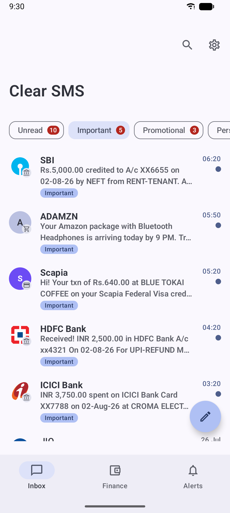
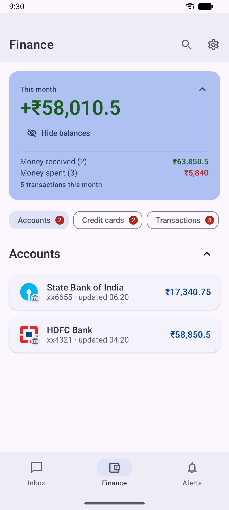
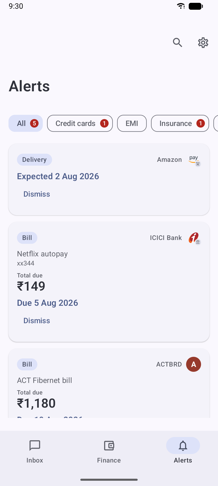
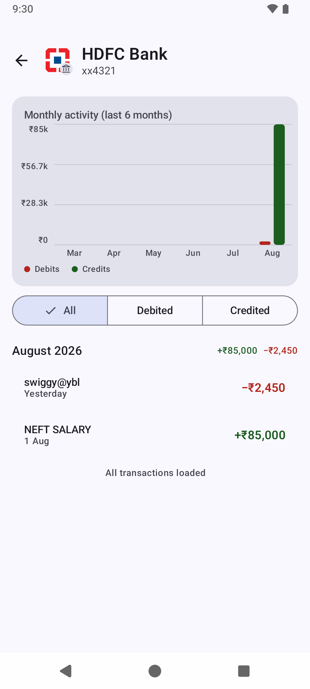
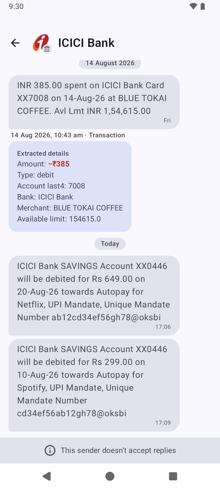
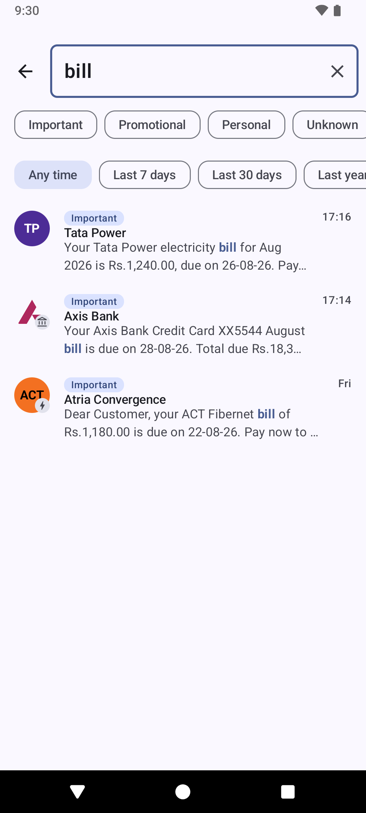
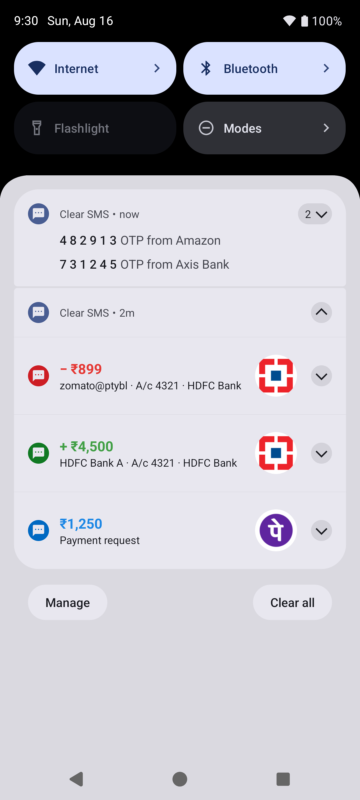
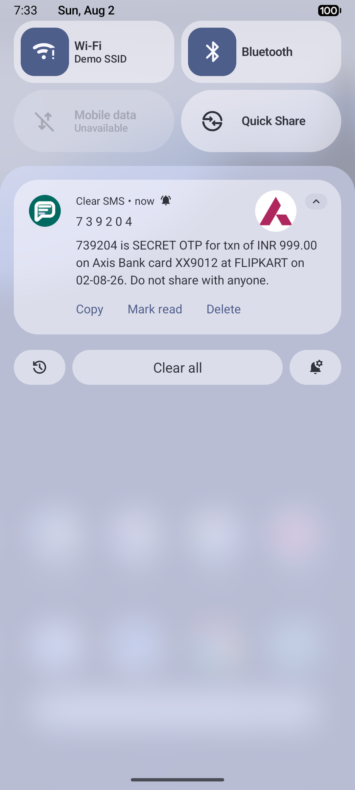
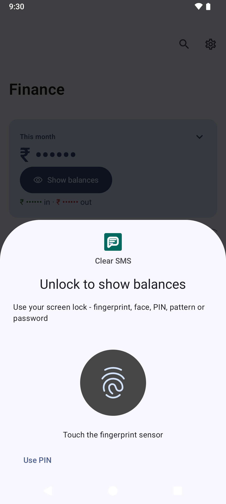
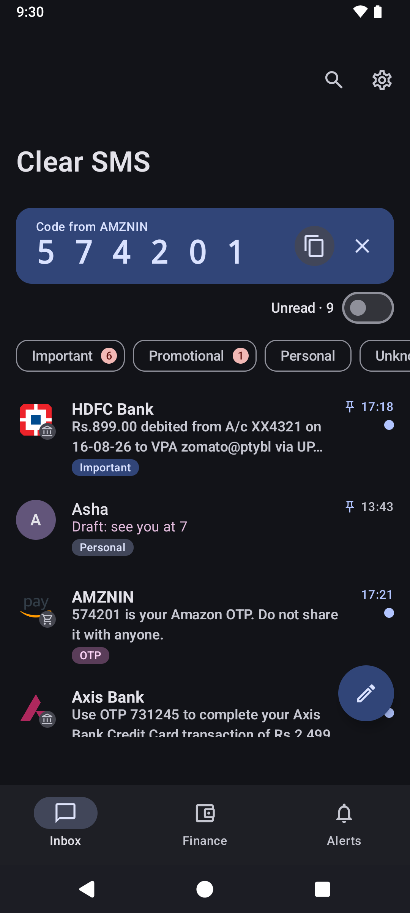

# Clear SMS

**Clear SMS** is an open-source, privacy-first SMS app for Android that automatically
organizes your inbox. It categorizes messages (Important / Promotional / Personal / OTP / Spam),
extracts transactions into a personal finance dashboard, surfaces bill reminders, and
handles OTPs intelligently - all completely offline, on your device.

## Screenshots

| Smart inbox | Finance | Alerts |
| :---: | :---: | :---: |
|  |  |  |

| Account detail | Extracted transaction | Search |
| :---: | :---: | :---: |
|  |  |  |

| Parsed notifications | OTP notification | Balance lock | Dark theme |
| :---: | :---: | :---: | :---: |
|  |  |  |  |

## Features

- **Smart inbox** - messages are automatically sorted into Important, Promotional,
  Personal, Unknown, OTP, and Spam using a transparent, regex-based rules engine (no ML black box).
- **MMS receive & send** - picture messages download automatically and can be
  sent from the compose bar (attach from the photo picker, camera, or any
  file; images are compressed to carrier limits on-device). MMS already on
  the phone is imported too, so picture messages that arrived before Clear
  SMS became your default app still show up. Both directions
  ride the Android system's MMS service, over the carrier network only - see
  Privacy Principles. Image bubbles, a full-screen viewer, and attachment
  files stored app-privately. You can also share an image straight from your
  gallery into a new message. Where a carrier has switched MMS off entirely,
  the attach button is hidden rather than offering a send that can only
  fail. Group MMS is attributed to its sender; a
  dedicated group-conversation UI is not built yet, and MMS delivery reports
  are not supported (sent messages cap at "Sent").
- **Finance dashboard** - debit/credit transactions are extracted from bank SMS into
  accounts, credit cards, and spend summaries with hand-rolled Compose charts.
- **Bills & reminders** - upcoming bills and payment due dates in one Alerts view.
- **OTP handling** - big, copyable OTP notifications, optional auto-copy, and
  configurable auto-delete (24h / 3d / 7d / never).
- **Scam awareness** - heuristic flagging of likely scam/fraud messages.
- **Material You** - dynamic color on Android 12+, with a curated teal/indigo palette
  on older devices. Light, dark, and system themes.
- **Community rules** - categorization rules are plain JSON, bundled with the app and
  maintained by the community in this repository.

## Feature checklist

Everything shipped, and what's on the roadmap:

**Messaging**
- [x] SMS send & receive (default-SMS-app role, catch-up import when the role is regained)
- [x] MMS receive (auto-download, image bubbles, full-screen viewer, retry on failure), including a catch-up import of MMS already on the phone - messages that arrived before Clear SMS became the default app, or while another app held the role, are read out of the shared system store with their text and images
- [x] Attach button hidden on a SIM whose carrier config says MMS is switched off, so it is never offered where it can only fail
- [x] MMS send (photo picker / camera / any file, SIM-aware; images are compressed on-device to fit the sending SIM's carrier size limit, and anything that still will not fit is refused before the carrier is ever contacted)
- [x] Dual-SIM (per-recipient SIM memory, SIM tags on messages); the compose bar shows the slot that will send, long-press names it, and it takes the system's own SIM colour where that stays legible
- [x] Message scheduling (long-press Send; survives reboots)
- [x] Optional delay before sending, with a Cancel that puts the text back for editing (off by default; survives the app being killed)
- [x] Opens `sms:`, `smsto:`, `mms:` and `mmsto:` links from other apps, with recipient and body prefilled
- [x] Per-thread drafts with inbox preview
- [x] Expand the compose box to fill the screen for long messages (both the standalone composer and a conversation)
- [x] Delivery status: Sending / Sent / Delivered (real reports only) / Not sent + retry (a failed MMS says why in the phone's own terms - no MMS connection, carrier MMS settings missing, refused by the carrier; a failed SMS says when the phone had no service, or when the phone's own premium-short-code guard blocked the send - and the diagnostic report records the raw platform result code); a single tick on sent and a double tick on delivered bubbles (never on failed, in-flight, scheduled or MMS-delivered), each announced to screen readers
- [x] Share & forward selected messages; share text or images from other apps into a new message
- [x] Selection bar with Copy, Delete, More details and Forward/Share, in an order you can rearrange (Settings → Messages → Message action order)
- [x] Per-message details (type, to/from, sent & received time - the Sent row is omitted when the network reported no sent time - delivery time when a real report exists, a plain "Yes" when a report exists but no time was recorded, and failure reason)
- [x] Replies to numeric short codes (the "reply WEITER to re-enable data" case); a short code you saved as a contact opens the composer directly, and an alphanumeric sender id explains that the phone cannot address a reply to a name instead of pretending the sender refuses them
- [x] Tappable links, phone numbers and UPI payment links in messages (tapping a number opens the dialer; scam-flagged messages warn first)
- [x] Undo for delete & archive (Gmail-style snackbar)
- [x] Strip accents before sending, so one diacritic does not turn a single SMS into several (opt-in setting; applies silently, and only when it actually saves a message)
- [x] Configurable swipe dead zone with a live translucent preview, for phones where scrolling triggered swipe actions
- [x] Swipe-away in-app notification bars ("Message sent", schedule confirmations); swiping an UNDO bar keeps the deletion
- [x] Recycle bin (on by default, 30-day retention, restore & delete-forever; tap a binned message to read it in full first)
- [x] Call button in a conversation, and tap-the-name to view or create the contact (service senders explain themselves instead of doing nothing)
- [x] Pinned conversations
- [x] Sort conversations and messages by the sender's network send time instead of the time the phone received them (Settings → Messages; the sent time is stored per message and falls back to the received time when the network reported none)
- [x] Blocked senders & blocked keywords (both go straight to the bin, silently; blocking also bins the existing conversation)
- [x] Mute a sender: messages still arrive and appear, but never notify (scam warnings still do); muted threads are marked in the inbox and conversation
- [x] Launcher shortcuts (long-press the app icon, Android 7.1+): "New message" plus your pinned and most recent conversations with their inbox avatars, as many as the launcher's own budget allows; blocked, muted, binned and spam conversations never appear, and a shortcut disappears the moment its thread does. The conversation shortcuts can be turned off in Settings → Messages (the setting says plainly that names and photos are handed to the launcher and the share sheet)
- [x] Direct Share targets (Android 10+): the same pinned and recent conversations appear in the system share sheet's direct-share row when another app shares text or a single picture; a pick opens the composer with that conversation prefilled and the content carried in, never auto-sent. Same shortcuts, same exclusions and the same single setting as the launcher shortcuts - only conversations with a number the phone can address are offered, since the composer cannot send to an alphanumeric sender id
- [ ] Contact names (instead of bare numbers) in the blocked-senders list
- [x] Conversation notifications (Android 11+): a message notification names its conversation shortcut, so it files under the system's Conversations section with per-conversation controls; when the shortcut is absent (setting off, outside the launcher's budget, excluded thread) the notification is posted exactly as before - a missing shortcut never delays or drops a message
- [ ] Bubbles - would need a dedicated resizeable, embeddable conversation activity and a floating conversation UI on top of the shortcut plumbing
- [ ] Group-MMS conversation UI (group messages currently attribute to their sender)
- [ ] MMS delivery reports
- [ ] Attachments persisted in drafts
- [ ] Scheduling for messages with attachments (currently SMS-only)
- [ ] Blocked keywords applied to MMS bodies
- [ ] Video compression for MMS (oversized videos are refused with a clear
      message; real transcoding needs MediaCodec/Media3 Transformer)

**Smart inbox**
- [x] Automatic categorization: Important / Promotional / Personal / OTP / Unknown / Spam (466 community rules + 715k sender directory)
- [x] Automatic full re-sort after an app update ships new rules, with a progress banner in the inbox
- [x] A rule added from a message applies to that sender's existing messages at once (body-only rules point you at the full re-sort instead)
- [x] One-step "Always sort as" rules from a message, no regex needed; the full editor explains any rejection
- [x] Category filter pills: choose which are visible and drag them into the order you want, on the Inbox, Finance and Alerts tabs (tags hidden under single-category filters)
- [x] Tap the title bar to jump back to the top of a long list
- [x] Hide whole sections you do not use (Inbox, Finance or Alerts) from Settings - the tab disappears and its notifications stop; at least one stays on
- [x] Full-text search with category & time filters, matching contact and sender names as well as message text
- [x] Tapping a search result opens the conversation at that message and highlights it, however old it is
- [x] Scam-awareness flagging
- [x] Rule manager: search, enable/disable, tap-to-edit your rules, duplicate bundled ones
- [x] Contact suggestions while typing a recipient (compose) or a sender to block
- [ ] Alphabet fast-scroll in the contact list

**Finance & alerts**
- [x] Transactions extracted into accounts, cards & wallets with spend charts
- [x] Balance tracking with biometric balance lock
- [x] Amounts in the message's own currency - detected from the message, then from the SIM's country or the device locale, with a Settings override - and totals are never summed across currencies (each summary speaks one currency; other-currency rows are counted, not added)
- [x] Bills, autopay, insurance & credit-card due reminders (CRED, BOBCARD statements and undated bills included)
- [x] Train & flight journeys in Alerts (including compact Indian Railways PNR messages)
- [x] Deliveries with courier & tracking id
- [x] Time-aware alerts with a complete, restorable "Older" archive
- [x] Cross-bank UPI duplicate collapsing; retirement contributions as credits
- [ ] Conversation details screen (per-sender rename, category & finance view)
- [ ] Per-conversation custom notifications

**Notifications & OTP**
- [x] Parsed transaction notifications with semantic colors and brand logos
- [x] Big copyable OTP notifications, auto-copy, auto-delete policies, one-shot cleanup
- [x] Always-visible Copy OTP button on OTP messages in a conversation
- [x] Notifications clear when messages are read in-app (recycle-bin-aware actions)
- [x] Missed-message notifications after signal loss or default-app switches
- [x] Messages from unrecognised senders get their own notification category, on by default
- [x] A Settings shortcut into Android's own per-category notification settings
- [ ] App-wide biometric/PIN lock (today the lock covers Finance balances)

**Data & privacy**
- [x] Fully offline: no INTERNET permission (sole exception: the system's carrier MMS transaction)
- [x] Local backup & restore for messages AND settings (timestamped files, chosen folder, scheduled)
- [x] Settings backup with security-sensitive keys excluded by design, and your own rules travel with it
- [x] Share diagnostic logs from Settings when reporting a bug - the app records no message text, contacts, numbers, OTPs or account numbers, you preview the exact text first, and you choose whether sender IDs are masked
- [x] Settings organised into sections, with search that reaches settings inside them
- [ ] Encrypted backups

## Privacy Principles

- **Offline by design.** The app requests no INTERNET permission and makes no
  network calls of its own - no servers, no telemetry, no analytics. The one
  exception is inherent to MMS: retrieving a picture message is a transaction
  the *Android system's* MMS service performs with your carrier's MMSC over
  the carrier network. That transaction is how the MMS protocol works, never
  leaves the carrier network, and involves no third party.
- **No proprietary dependencies.** No Firebase, no Play Services - pure AOSP compatible.
- **Your data stays on your device.** Backups are local files you control.
- **Transparent categorization.** Every rule is human-readable JSON you can inspect,
  edit, export, and contribute back.

## Building

Requirements, the CI check commands, and notes on the release APK (R8-shrunk,
not obfuscated, reproducible for F-Droid) are in [docs/building.md](docs/building.md).

## Release signing (CI)

How CI signs release APKs, which repository secrets to configure, and how a
`v*` tag becomes a GitHub Release are in
[docs/release-signing.md](docs/release-signing.md).

## Contributing Rules

Categorization rules are plain JSON under [`rules/`](rules/), bundled into the
APK at build time. [docs/contributing-rules.md](docs/contributing-rules.md)
covers the two ways to contribute (pull request, or *Settings → Rules → Share
rules with developer* from the app), auditing your own inbox for missing rules
with `scripts/audit_rule_coverage.py`, the sender ID database, the brand
identity table, and the bundled sender logos. The JSON schema itself is in
[CONTRIBUTING.md](CONTRIBUTING.md).

## Translations

The app ships in English and welcomes partial community translations -
untranslated strings fall back to English automatically. How to translate
(copy `values/` to `values-<code>/`, plural quantities, positional
arguments, testing, and why it must be a pull request) is in
[docs/translating.md](docs/translating.md). The table below is generated
by `scripts/translation_status.py` and checked by a unit test.

<!-- translation-status:start -->
<!-- Generated by scripts/translation_status.py - do not edit by hand. -->
| Language | Code | Translated | Coverage |
| --- | --- | ---: | ---: |
| Hindi | `hi` | 793 / 793 | 100% |
| Polish | `pl` | 793 / 793 | 100% |
| Russian | `ru` | 793 / 793 | 100% |

Coverage counts strings the translation defines, out of 793 translatable items in English (each plural counted once); it measures presence, not quality. Regenerate with `python3 scripts/translation_status.py`.
<!-- translation-status:end -->

## License

[Apache License 2.0](LICENSE)
